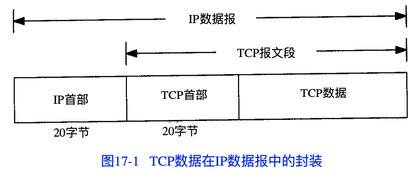
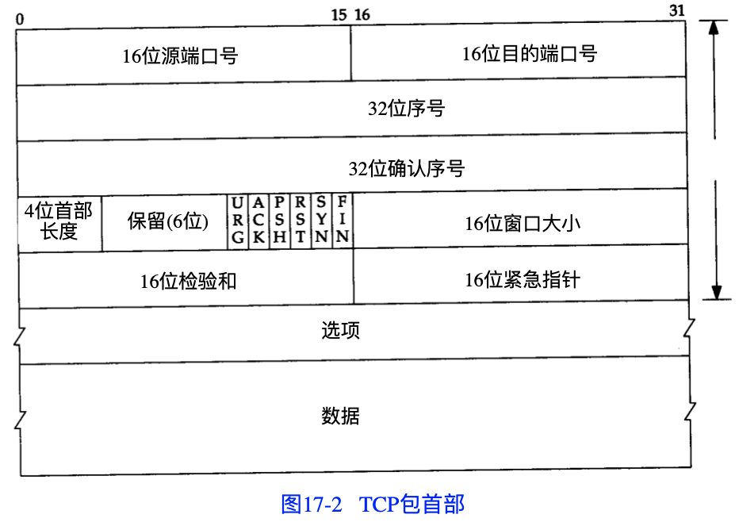
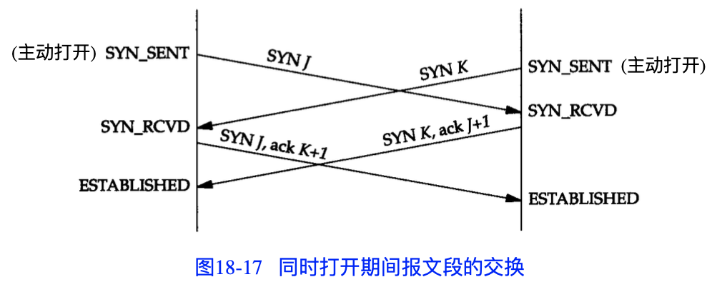
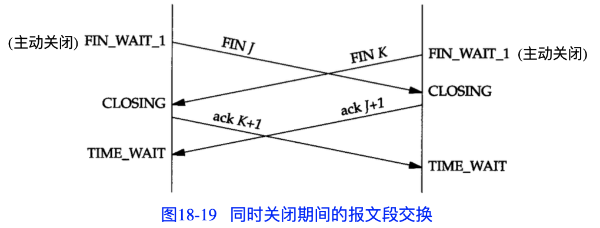
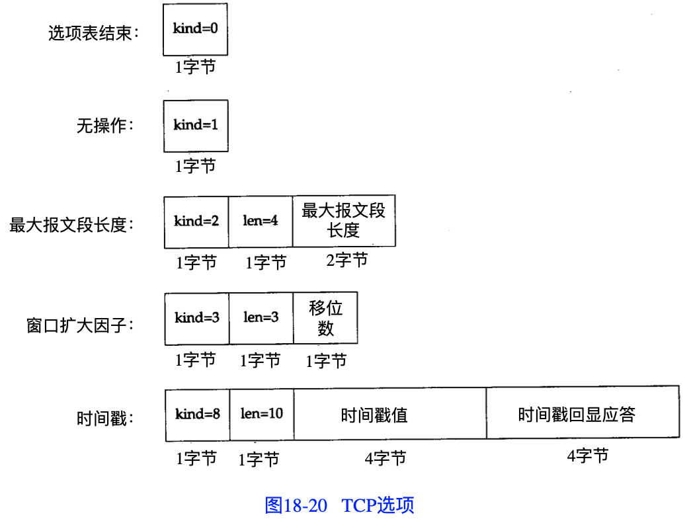
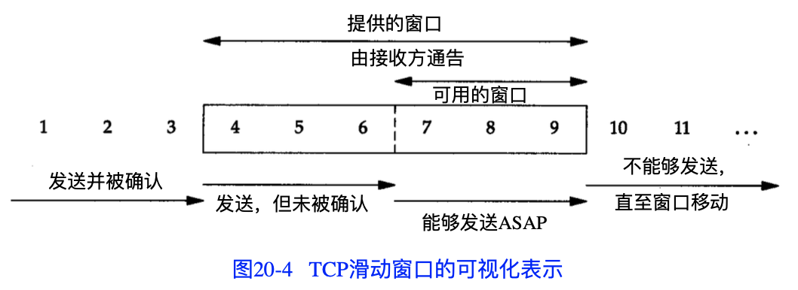
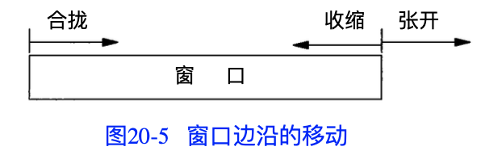

# TCPIP详解 卷1：协议

## 第1章 概述

### 1.2 分层

- 链路层、网络层、运输层、应用层

## 第17章 TCP：传输控制协议

### 17.3 TCP的首部

- TCP数据在IP数据报中的封装

  

- TCP包首部

  

## 第18章 TCP连接的建立与终止

### 18.2 连接的建立与终止

#### 18.2.3 建立连接协议

- ISN（Initial Sequence Number，初始序列号）随时间而变化，因此每个连接都将具有不同的ISN。RFC 793指出ISN可看作是一个32位的计数器，每4ms加1。这样选择序号的目的在于防止在网络中被延迟的分组在以后又被传送，而导致某个连接的一方对它作错误的解释
  - 在4.4BSD中，系统初始化时ISN被初始化位1。这个变量每0.5s增加64000。另外，每次建立一个连接后，这个变量将增加64000

### 18.3 连接建立的超时

#### 18.3.1 第一次超时时间

- 第一次超时时间在5.5s~6s之间，这是因为BSD的实现采用一种500ms定时器。连接开始时，将建立一个6s的定时器（12个时钟滴答，但它可能在之后的5.5s~6s内的任意时刻超时）。尽管定时器初始化位12个时钟滴答，但定时计数器会在设置后的第一个0~500ms中的任意时刻减1。从那以后，定时计数器大约每隔500ms减1，但在第一个500ms内是可变的（使用“大约”是因为在TCP每隔500ms获得系统控制的瞬间，系统内核可能会优先处理其他中断）
- 第二次超时时间几乎准确地为24s

### 18.5 TCP的半关闭

- TCP提供了连接的一端在结束它的发送后还能接收来自另一端数据的能力

- 如果应用程序不调用close而调用shutdown，且第二个参数值为1，则socket API支持半关闭

### 18.6 TCP的状态变迁图

#### 18.6.1 2MSL等待状态

- RFC 793指出MSL为2分钟。然而，实现中的常用值是30s，1分钟或2分钟

- 一个socket pair在它处于2MSL等待时，将不能再被使用。尽管许多具体的实现中允许一个进程重新使用仍处于2MSL等待的端口（通常是设置选项SO_REUSEADDR），但TCP不能允许一个新的连接建立在相同的socket pair上

#### 18.6.2 平静时间的概念

- TODO
- RFC 793指出TCP再重启后的MSL秒内不能建立任何连接，这就称为平静时间

#### 18.6.3 FIN_WAIT_2状态

- 如果被动关闭那一端的应用进程没有进行关闭，那么主动关闭的一端可能永远保持FIN_WAIT_2状态，另一端也将处于CLOSE_WAIT状态，并一直保持这个状态知道应用层决定进行关闭
- 许多BSD实现采用如下方法来防止这种再FIN_WAIT_2状态的无限等待：如果执行主动关闭的应用层将进行全关闭，而不是半关闭来说明它还想接收数据，就设置一个定时器。如果这个连接空闲10分钟75秒，TCP将进入CLOSED状态

### 18.7 复位报文段

- 无论何时，一个报文段发往基准的连接（由socket pair指明的连接）出现错误，TCP都会发出一个复位报文段

#### 18.7.1 到不存在的端口的连接请求

#### 18.7.2 异常终止一个连接

- 有可能发送一个复位报文段而不是FIN来中途释放一个连接，这样做对应用程序来说有两个优点
  - 丢弃任何待发数据并立即发送复位报文段
  - RST的接收方会区分另一端执行的是异常关闭还是正常关闭

- RST报文段不会导致另一端产生任何响应，另一端根本不进行确认。收到RST的一方将终止该连接，并通知应用层连接复位
- socket API通过linger on close选项（SO_LINGER）提供了这种异常关闭的能力

#### 18.7.3 检测半打开链接

- 如果一方已经关闭或异常终止连接而另一方却还不知道，我们将这样的TCP连接称为半打开。任何一端的主机异常（如突然断电）都可能导致发生这种情况。只要不打算在半打开的连接上传输数据，仍处于连接状态的一方就不会检测另一方已经出现异常

### 18.8 同时打开

- TCP是特意设计为了可以处理同时打开，对于同时打开它仅建立一条连接而不是两条连接

- 同时打开期间的报文段的交换

  

### 18.9 同时关闭

- 同时关闭期间报文段的交换

  

### 18.10 TCP选项

- TCP选项

  

### 18.11 TCP服务器的设计

#### 18.11.4 呼入连接请求队列

- TODO

## 第19章 TCP的交互数据流

### 19.3 经受时延的确认

- 通常TCP在接收到数据时并不立即发送ACK；相反，它推迟发送，以便将ACK与需要沿该方向发送的数据一起发送（有时称这种现象为数据捎带ACK）。绝大多数实现采用的时延为200ms

### 19.4 Nagle算法

- 该算法要求一个TCP连接上最多只能有一个未被确认的小分组，在该分组的确认到达之前不能发送其他的小分组。相反，TCP收集这些少量的分组，并在确认到来时以一个分组的方式发出去
- 该算法优越之处在于它是自适应的：确认到达得越快，数据也就发送得越快。而在希望减少小分组数目的低俗广域网上，则会发送更少的分组

#### 19.4.1 关闭Nagle算法

- 有时候我们也需要关闭Nagle算法。一个典型的例子是X窗口系统服务器：小消息（鼠标移动）必须无时延地发送，以便为进行某种操作的交互用户提供实时的反馈
- socket API可以使用TCP_NODELAY选项来关闭Nagle算法

## 第20章 TCP的成块数据流

### 20.2 正常数据流

- 使用TCP滑动窗口协议时，接收方不必确认每一个收到的分组。在TCP中，ACK时累积的——它们表示接收方已经正确收到了一直到确认序号减1的所有字节

### 20.3 滑动窗口

- TCP滑动窗口的可视化表示

  

- 窗口边沿的移动

  
  - 窗口合拢，发生在数据被发送和确认时
  - 窗口张开，发生在另一端的接收进程读取已经确认的数据并释放了TCP的接收缓存时
  - 窗口收缩，RFC强烈建议不要使用这种方式。但TCP必须能够在某一端产生这种情况时进行处理

- 如果左边沿到达右边沿，则称其为一个零窗口，此时发送发不能够发送任何数据

### 20.4 窗口大小

- 由接收方提供的窗口大小通常可以由接收进程控制，这将影响TCP的性能

### 20.5 PUSH标志

- 发送方使用该标志通知接收方将所收到的数据全部提交给接收进程，这里的数据包括与PUSH一起发送的数据以及接收方TCP已经为接收进程收到的其他数据
- 通过允许客户应用程序通知其TCP设置PUSH标志，客户进程通知TCP在向服务器发送一个报文段时，不要因等待额外数据而使已提交数据在缓存中滞留。类似地，党服务器的TCP接收到一个设置了PUSH标志的报文段时，它需要立即将这些数据递交给服务器进程而不能等待判断是否还会有额外的数据到达
- 然而，目前大多数socket API没有向应用程序提供通知其TCP设置PUSH标志的方法

### 20.6 慢启动

- 迄今为止，在本章所有的例子中，发送方一开始便向网络发送多个报文段，直至达到接收方通告的窗口大小为止。当发送方和接收方处于同一个局域网时，这种方式是可以的。但是如果在发送方和接收方之间存在多个路由器和速率较慢的链路时，就有可能出现一些问题。 一些中间路由器必须缓存分组，并有可能耗尽存储器的空间

- 现在，TCP需要支持一种被称为“慢启动”的算法。该算法通过观察到新分组进入网络的速率应该与另一端返回确认的速率相同而进行工作
- 慢启动为发送方的TCP增加了另一个窗口：拥塞窗口（congestion window），记为cwnd
- 当与另一个网络的主机建立TCP连接时，拥塞窗口被初始化为1个报文段（即另一端通告的报文段大小）。每收到一个ACK，拥塞窗口就增加一个报文段（cwnd以字节为单位，但是慢启动以报文段大小为单位进行增加）。发送方取拥塞窗口与通告窗口中的最小值作为发送上限
- 拥塞窗口是发送方使用的流量控制，而通告窗口则是接收方使用的流量控制

### 20.7 成块数据的吞吐量

- TODO

### 20.8 紧急方式

- URG被置1，并且一个16位的紧急指针被置位一个正的偏移量，该偏移量必须与TCP首部中的序号字段相加，以便得出紧急数据的最后一个字节的序号
- TCP必须通知接收进程，何时已接收到一个紧急数据指针以及何时某个紧急数据指针还不在此连接上，或者紧急指针是否在数据流中向前移动。接着接收进程可以读取数据流，并必须能够被告知何时碰到了紧急数据指针。只要从接收方当前读取位置到紧急数据指针之间有数据存在，就认为应用程序处于“紧急方式”。在紧急指针通过之后，应用程序便转回到正常方式
- TCP本身对紧急数据知之甚少。没有办法指明紧急数据从数据流的何处开始。TCP通过连接传送的唯一信息就是紧急方式已经开始（TCP首部中的URG位）和指向紧急数据最后一个字节的指针。其他的事情留给应用程序去处理
- 不幸的是，许多实现不正确地称TCP的紧急方式为带外数据（out-of-band data）。TCP的紧急方式与带外数据之间的混淆，也是因为主要的socket API将TCP的紧急方式映射为称为带外数据的借口
- TODO

## 第21章 TCP的超时与重传

### 21.1 引言

- 对于每个连接，TCP管理4个不同的定时器
  - 重传定时器使用于当希望收到另一端的确认
  - 坚持（persist）定时器使窗口大小信息保持不断流动，即使另一端关闭了其接收窗口
  - 保活（keepalive）定时器可检测到一个空闲连接的另一端何时崩溃或重启
  - 2MSL定时器测量一个连接处于TIME_WAIT状态的时间

### 21.2 超时与重传的简单例子

- 指数退避（exponential backoff）
  - 连续重传之间不同的时间差：1.5、3、6、12、24、48、64、64、64
  - 第一次发送后所设置的超时时间为1.5s，此后该时间在每次重传时增加1倍并直至64s
  - 首次分组传输与复位信号传输之间的时间差约为9分钟，该时间在目前的TCP实现中是不可变的

### 21.3 往返时间RTT的测量

- TODO

### 21.6 拥塞避免算法

- 该算法假定由于分组收到损坏引起的丢失是非常少的（远小于1%），因此分组丢失就意味着在源主机和目的主机之间的某处网络上发生了拥塞。有两种分组丢失的指示：发生超时和接收到重复的确认
- 拥塞避免算法和慢启动算法是两个目的不同、独立的算法。但是当拥塞发生时，我们希望降低分组进入网络的传输速率，于是可以调用慢启动来作到这一点。在实际中这两个算法通常在一起实现
- 拥塞避免算法和慢启动算法需要对每个连接维持两个变量：一个拥塞窗口cwnd和一个慢启动门限ssthresh。这样得到的算法的工作过程如下：
  - 对一个给定的连接，初始化cwnd为1个报文段，ssthresh为65535个字节
  - TCP输出例程的输出不能超过cwnd和接收方通告窗口的大小。拥塞避免是发送方使用的流量控制，而通告窗口则是接收方进行的流量控制。前者是发送方感受到的网络拥塞的估计，而后者则与接收方在该连接上的可用缓存大小有关
  - 当拥塞发生时（超时或收到重复确认），ssthresh被设置为当前窗口大小的一半（cwnd和接收方通告窗口大小的最小值，但最少为2个报文段）。此外，如果是超时引起了拥塞，则cwnd被设置为1个报文段（这就是慢启动）
  - 当新的数据被对方确认时，就增加cwnd，但增加的方法依赖于我们是否正在进行慢启动或拥塞避免。如果cwnd小于或等于ssthresh，则正在进行慢启动，否则正在进行拥塞避免。慢启动一直持续到我们回到当拥塞发生时所处位置的半时候才停止（因为我们记录了在步骤2中给我们制造麻烦的窗口大小的一半），然后转为执行拥塞避免

- TODO