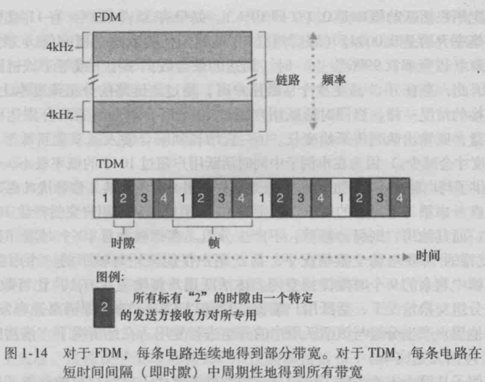
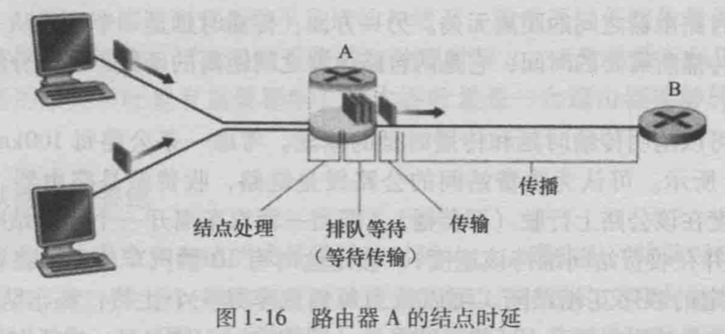
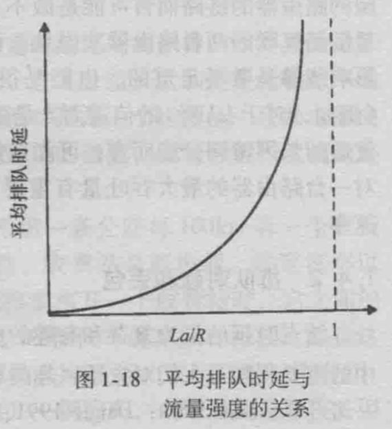
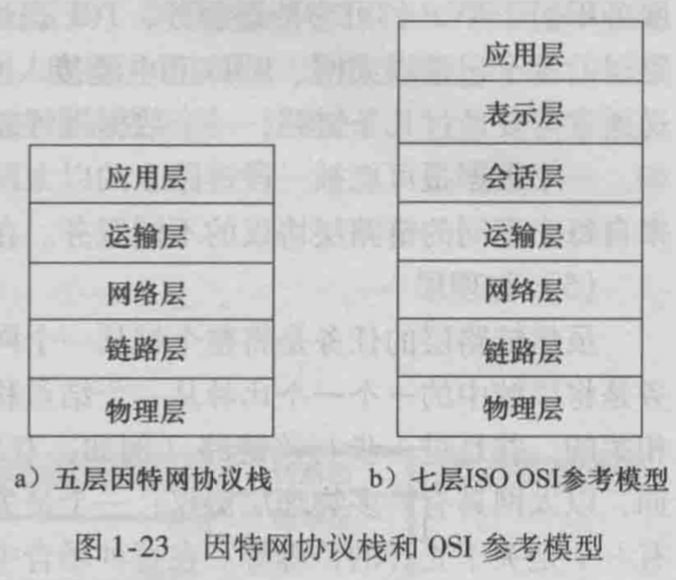
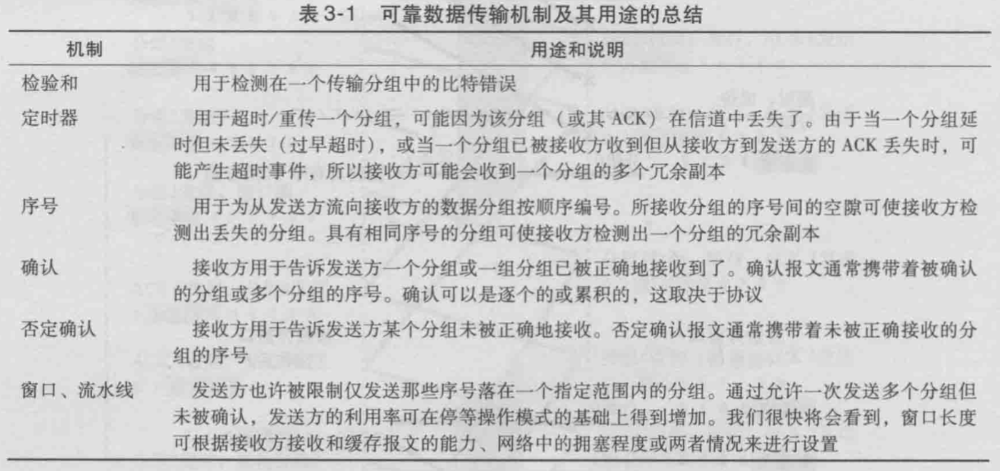
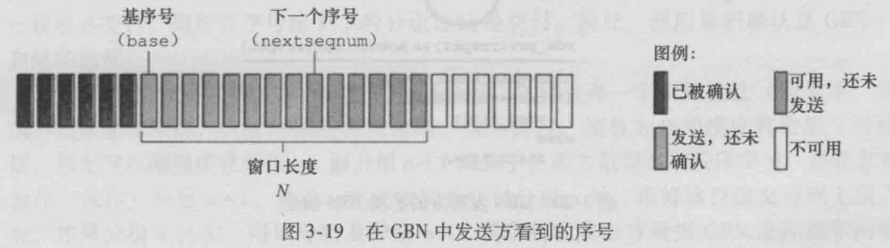
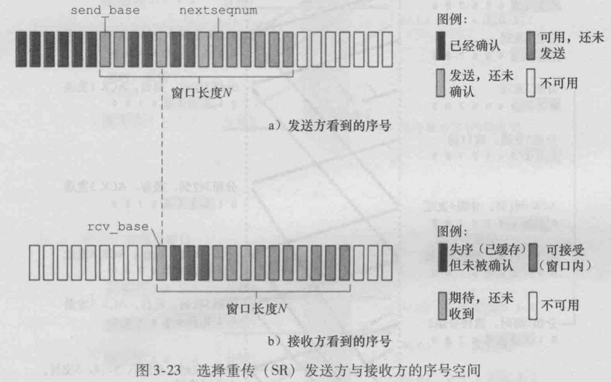
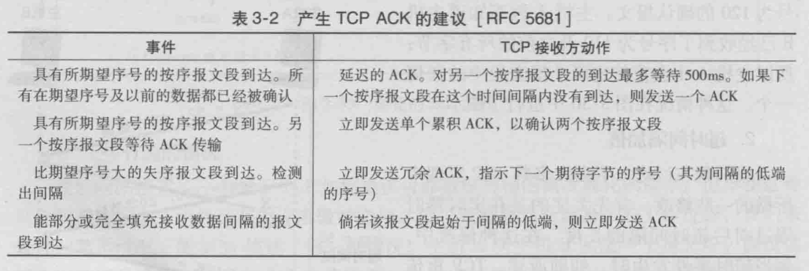
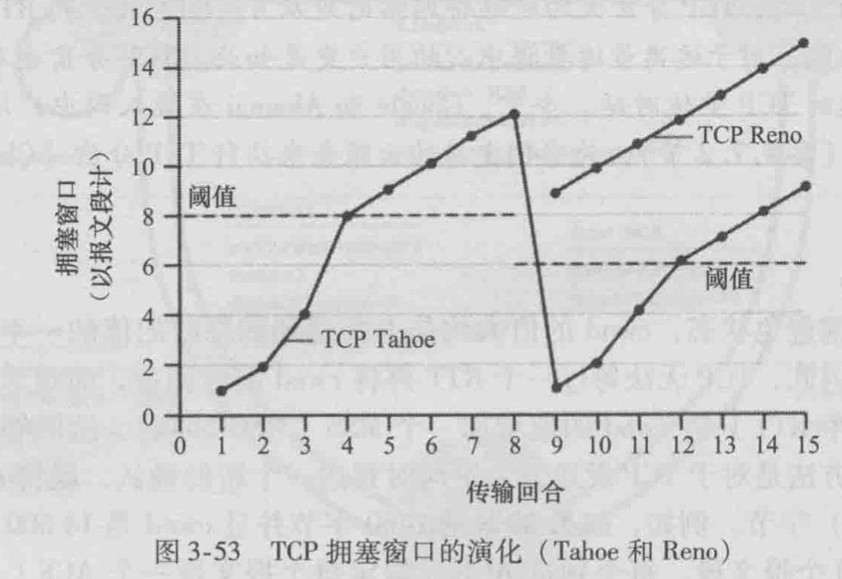
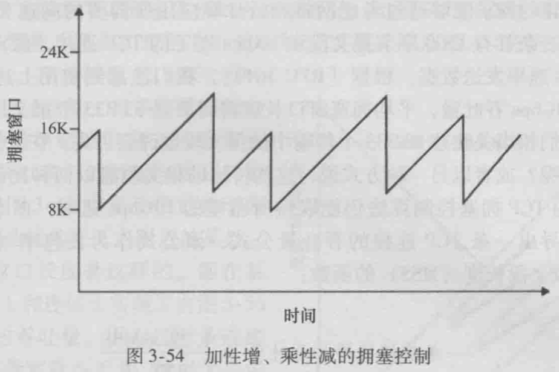

# 计算机网络自顶向下方法

## 第1章 计算机网络和因特网

### 1.1 什么是因特网

#### 1.1.1 具体构成描述

- 主机/端系统、通信链路、分组交换机（包括路由器和链路层交换机两类）

### 1.3 网络核心

#### 1.3.1 分组交换

- 存储转发传输
  - 大多数分组交换机在链路的输入端使用存储转发传输机制。存储转发机制是指交换机能够开始向输出链路传输该分组的第一个比特之前，必须接收到整个分组
  - 由N条速率均为R的链路组成的链路（在源和目的地之间有N - 1台路由器），从源到目的地发送一个L比特分组，端到端时延是：$d=N\frac{L}{R}$

- 排队时延和分组丢失
- 转发表和路由选择协议

#### 1.3.2 电路交换

- 通过网络链路和交换机移动数据有两种基本方法：电路交换和分组交换

- 在电路交换网络中，在端系统间通信会话期间，预留了端系统间通信沿路径所需要的资源（缓存、链路传输速率）。在分组交换网络中，这些资源不是预留的：会话的报文按需使用这些资源，其后果可能是不得不等待（即排队）接入通信线路

- 电路交换网络中的复用

  - 链路中的电路是通过频分复用（Frequency-Division Multiplexing，FDM）或时分复用（Time-Division Multiplexing，TDM）来实现的

  - 对于FDM，链路的频谱由跨越链路创建的所有连接所共享。特别是，在连接期间为每条连接专用一个频段

  - 对于TDM，时间被划分为固定区间的帧，并且每帧又被划分为固定数量的时隙。当网络跨越一条链路创建一条连接时，网络在每个帧中为该链接指定一个时隙。这些时隙专门由该连接单独使用，一个时隙可用于传输该连接的数据

  - FMD和TMD的一个例子

    

### 1.4 分组交换网中的时延、丢包和吞吐量

#### 1.4.1 分组交换网中的时延概述

- 路由器A的节点时延

  

  - 当分组从上游节点到达路由器A时，路由器A检查该分组的首部以决定该分组的适当处链路，并将该分组导向该链路
  - 仅当在该链路没有其他分组正在传输并且没有其他分组排在该队列的前面时，才能在这条链路上传输该分组；如果该链路当前正繁忙或有其他分组已经在该链路上排队，则新到达的分组则将参与排队

- 时延的类型
  - 处理时延（$d_{proc}$）：检查分组首部和决定将该分组导向何处所需要的时间是处理时延的一部分。处理时延也能包括其他因素，如检查比特级别的差错所需要的时间
  - 排队时延（$d_{queue}$）：在队列中，当分组在链路上等待传输时，它经受排队时延
  - 传输时延（$d_{trans}$）：用L比特表示该分组的长度，用R bps表示从路由器A到路由器B的链路传输速率，传输时延是L/R。这是将所有分组的比特推（传输）向链路所需要的时间。传输时延是路由器将分组推出所需要的时间，它是分组长度和链路传输速率的函数，而与两台路由器之间的距离无关
  - 传播时延（$d_{prop}$）：一个比特从一台路由器向另一台路由器传播所需要的时间，它是两台路由器之间距离的函数，与分组长度或链路传输速率无关

#### 1.4.2 排队时延和丢包

- 排队时延对每个分组可能是不同的，因此，当表征排队时延时，人们通常使用统计量测度，如平均排队时延、排队时延的方差和排队时延超过某些特定值的概率

- 排队时延取决于到达该队列的速率、链路的传输速率和到达流量的性质，即流量是周期性到达还是以突发形式到达

- 令a表示分组到达队列的平均速率（单位是分组/秒，即pkt/s）。则比特到达队列的平均速率是La bps。假定该队列无限大。比率La/R被称为流量强度，它在估计排队时延的范围方面经常起着重要的作用

  - 如果La/R > 1，则比特到达队列的平均速率超过从该队列传输出去的速率。在这种不幸的情况下，该队列趋向于无限增加，并且排队时延将趋向无穷大

  - La/R <= 1时，这时，到达流量的性质影响排队时延。如果分组周期性到达，即每L/R秒到达一个分组，则每个分组到达一个空队列中，不会有排队时延。在另一方面，如果分组以突发形式到达而不是周期性到达，则有很大的平均排队时延。例如，假定每(L/R)N秒同时到达N个分组，则传输的第一个分组没有排队时延；传输第n个分组具有(n-1)L/R秒的排队时延

  - 平均排队时延与流量强度的定性关系如图所示

    

    该图的一个重要方面是这样一个事实：随着流量强度接近于1，平均排队时延迅速增加。该强度少量的增加将导致时延大得多的增加

- 丢包
  
  - 在现实中，因为队列容量是有限的，随着流量强度接近1，排队时延并不实际趋向无穷大。相反，到达的分组将发现一个满的队列。由于没有地方存储这个分组，路由器将丢弃该分组，该分组将会丢失

### 1.5 协议层次及其服务模型

#### 1.5.1 分层的体系结构

- 因特网协议栈和OSI参考模型

  

## 第3章 运输层

### 3.4 可靠数据传输原理

- 可靠数据传输机制及其用途的总结

  

#### 3.4.3 回退N步

- 在回退N步（Go-Back-N，GBN）协议中，允许发送方发送多个分组而不需等待确认，但它也受限于在流水线中未确认的分组数不能超过某个最大允许数N

- 在GBN中发送方看到的序号

  

- N常被称为窗口长度，GBN协议也常被称为滑动窗口协议
- 为什么要限制这些被发送的、未被确认的分组的数目为N呢？
  - 流量控制是对发送发施加限制的原因之一
  - 拥塞控制是另一个原因

- GBN发送方必须响应三种类型的事件
  - 上层的调用：发送方受限检查发送窗口是否已满，若窗口未满，则产生一个分组并将其发送，并相应地更新变量；若窗口已满，发送方只需将数据返回给上层，隐式地指示上层该窗口已满。在实现中，发送方更可能缓存这些数据，或者使用同步机制允许上层在仅当窗口不满时才进行调用
  - 收到一个ACK：在GBN中，对序号为n的分组的确认采取累积确认的方式，表明接收方已正确接收到序号为n的以前且包括n在内的所有分组
  - 超时事件：如果出现超时，发送方重传所有已发送但还未被确认过的分组。发送方仅使用一个定时器，它可被当作是最早的已发送但未被确认的分组所使用的定时器。如果收到一个ACK，但仍有已发送但未被确认的分组，则定时器被重新启动。如果没有已发送但未被确认的分组，该定时器被终止

- GBN接收方的动作
  
  - 如果一个序号为n的分组被正确接收到，并且按序，则接收方为分组n发送一个ACK，并将该分组中的数据部分交付到上层。在所有其他情况下，接收方丢弃该分组，并为最近按序接收的分组重新发送ACK

#### 3.4.4 选择重传

- 选择重传（Selective Repeat，SR）协议通过让发送方仅重传那些它怀疑在接收方出错的分组而避免了不必要的重传。这种个别的、按需的重传要求接收方逐个地确认正确接收的分组

- 在SR中发送方与接收方看到的序号

  

- SR发送方所采取的动作
  - 从上层接收到数据：同GBN
  - 超时：每个分组必须拥有自己的逻辑定时器，因为超时发生后只能发送一个分组
  - 收到ACK：若该分组序号在窗口内，则SR发送方将那个被确认的分组标记为已接收。如果该分组的序号等于send_base，则窗口基序号向前移动到具有最小序号的未被确认分组处。如果窗口移动了并且有序号落在窗口内的为发送分组，则发送这些分组

- SR接收方所采取的动作
  - 序号在[rcv_base，rcv_base + N - 1]内的分组被正确接收：一个选择ACK被回送给对方。如果该分组以前没收到过，则缓存该分组。如果该分组的序号等于接收窗口的基序号（rcv_base），则该分组以及以前缓存的序号连续的分组交付给上层。然后，接收窗口按向前移动分组的编号向上交付这些分组
  - 序号在[rcv_base - N，rcv_base - 1]内的分组被正确收到：在此情况下，必须产生一个ACK，即使该分组是接收方以前已确认过的分组
  - 其他情况：忽略该分组

- 对SR协议而言，发送方和接收方的窗口并不总是一致

### 3.5 面向连接的运输：TCP

- 差错检验、重传、累积确认、定时器、序号和确认号

#### 3.5.3 往返时间的估计与超时

- 估计往返时间
  - 报文段的样本RTT（SampleRTT）就是从某报文段被发出到对该报文段的确认被收到之间的时间量。大多数TCP的实现仅在某个时刻做一次SampleRTT测量，而不是为每个发送的报文段测量一个SampleRTT
  - 为了估计一个典型的RTT，TCP维持一个SampleRTT均值（称为EstimatedRTT）。一旦获得一个新SampleRTT时，TCP就会根据下列公式来更新EstimatedRTT：$EstimatedRTT=(1-\alpha)·EstimatedRTT+\alpha·SampleRTT$。在RFC 6298中给出的$\alpha$参考值是0.125
  - 值得注意的是，EstimatedRTT是一个SampleRTT值的加权平均值。这个加权平均对最近的样本赋予的权值要大于对老样本赋予的全值。这是很自然的，因为越近的样本越能更好地反映网络的当前拥塞情况。从统计学观点讲，这种平均被称为指数加权移动平均（Exponential Weighted Moving Average，EWMA）
  - 除了估算RTT外，测量RTT的变化也是有价值的。RFC 2698定义了RTT偏差DevRTT，用于估算SampleRTT一般会偏离EstimatedRTT的程度：$$DevRTT=(1-\beta)·DevRTT+\beta·|SampleRTT-EstimatedRTT|$$。注意到DevRTT是一个SampleRTT与Estimated之间差值的EWMA。如果SampleRTT值波动较小，那么DevRTT的值就会很小；另一方面，如果波动很大，那么DevRTT的值就会很。$\beta$的推荐值为0.25

- 设置和管理重传超时间隔
  - 假设已经给出了EstimatedRTT值和DevRTT值，那么很明显，超时间隔应该大于等于EstimatedRTT。但是超时间隔也不应该比EstimatedRTT大太多。因此要求将超时间隔设为EstimatedRTT加上一定余量。当SampleRTT值波动较大时，这个余量应该大些；当波动较小时，这个余量应该小些。因此，DevRTT值在这里发挥作用了：$$TimeoutInterval=EstimatedRTT+4·DevRTT$$。推荐的初始TimeoutInterval值为1秒（RFC 6298）。同样，当出现超时后，TimeoutInterval值将加倍，以免即将被确认的后继报文段过早出现超时。不管怎样，一旦报文段收到并更新EstimatedRTT后，TimeoutInterval就又使用上述公式计算了

#### 3.5.4 可靠的数据传输

- 在研发可靠数据传输技术时，曾假定每一个已发送但未被确认的报文段都与一个定时器相关联，虽然这在理论上很好，但定时器的管理却需要相当大的开销。因此，推荐的定时器管理过程（RFC 6298）仅使用单一的重传定时器，即使有多个已发送但还未被确认的报文段
- 一个TCP发送方的高度简化的描述，该发送方只用超时来恢复报文段的丢失
  - 从上层应用程序接收数据：TCP从应用程序接收数据，将数据封装在一个报文段中，并把该报文段交给IP。如果定时器还没有为某些其他报文段而运行，则当报文段被传给IP时，TCP就启动该定时器。该定时器的过期间隔是TimeoutInterval，由EstimatedRTT和DevRTT计算得出
  - 超时：TCP通过重传引起超时的报文段来响应超时事件。然后TCP重启定时器
  - 来自接收方的ACK：TCP将ACK的值y与它的变量SendBase进行比较。TCP采用累积确认，所以y确认了字节编号在y之前的所有字节都已经收到。如果y大于SendBase，则该ACK是在确认一个或多个先前未被确认的报文段。因此发送方更新它的SendBase变量；如果当前还有未被确认的报文段，TCP还要重新启动定时器
- 超时间隔加倍
  - TCP重传具有最小序号的还未被确认的报文段，只是每次TCP重传时都会将下一次的超时间隔设为先前值的两倍，而不是从EstimatedRTT和DevRTT推算出的值
  - 例如，假设当定时器第一次过期时，与最早的未被确认的报文段相关联的TimeoutInterval是0.75s，TCP就会重传该报文段，并把新的过期时间设置为1.5s。如果1.5s后定时器又过期了，则TCP将再次重传该报文段，并把过期时间设置为3.0s。因此，超时间隔在每次重传后回呈指数型增长。然而，每当定时器在另两个事件（即收到上层应用的数据和收到ACK）中的任意一个启动时，TimeoutInterval由最近的EstimatedRTT和DevRTT推算得到
  - 这种修改提供了一个形式受限的拥塞控制。定时器过期很可能是由网络拥塞引起的，即太多的分组到达源与目的地之间路径上的一台（或多台）路由器的队列中，造成分组丢失或长时间的排队时延。在拥塞的时候，如果源持续重传分组，会使拥塞更加严重。相反，TCP使用更文雅的方式，每个发送方的重传都是经过越来越长的时间间隔后进行的

- 快速重传

  - 超时触发重传存在的问题之一是超时周期可能相对较长。当一个报文段丢失时，这种长超时周期迫使发送方延迟重传丢失的分组，因而增加了端到端时延。幸运的是，发送方通常可在超时时间发生之前通过注意所谓冗余ACK来较好地检测到丢包情况

  - TCP接收方的ACK生成策略

    

  - 因为发送方经常一个接一个地发送大量的报文段，如果一个报文段丢失，就很可能引起许多一个接一个的冗余ACK。如果TCP发送方接收到对相同数据的3个冗余ACK，它把这当作一种暗示，说明跟在这个已被确认过3次的报文段之后的报文段已经丢失。一旦收到3个冗余ACK，TCP就执行快速重传，即在该报文段的定时器过期之前重传丢失的报文段

- 是回退N步还是选择重传
  - TCP更像一个GBN风格的协议，但和GBN有一些显著的区别
    - 许多TCP实现会将正确接收但失序的报文段缓存起来
    - GBN不仅会重传超时分组，还会重传所有后继的分组；而TCP只重传超时分组
  - RFC 2018对TCP提出一种修改意见是所谓的选择确认（selective acknowledgement），它允许TCP接收方有选择地确认失序报文段，而不是累积地确认最后一个正确接收的有序报文段。因此，TCP的差错恢复机制也许最好被分类为GBN和SR的混合体

#### 3.5.5 流量控制

- TCP为它的应用程序提供了流量控制服务，以消除发送方使接收方缓存溢出的可能性。流量控制因此是一个速度匹配服务，即发送方的发送速率与接收方应用程序的读取速率相匹配

- TCP通过让发送方维护一个称为接收窗口的变量来提供流量控制

- 假设主机A通过一条TCP连接向主机B发送一个大文件。定义以下变量

  - LastByteRead：主机B上的应用进程从缓存读出的数据流的最后一个字节的编号
  - LastByteRcvd：从网络中到达的并且已放入主机B接收缓存中的数据流的最后一个字节编号
  - rwnd：接收窗口

  由于TCP不允许已分配的缓存溢出，下式必须成立：$LastByteRcvd-LastByteRead\le RcvBuffer$。并且，$rwnd=RcvBuffer-(LastByteRcvd-LastByteRead)$。开始时，主机B设定$rwnd=RcvBuffer$

  主机A在该连接的整个生命周期必须保证：$LastByteSent-LastByteAcked\le rwnd$

- 这个方案还存在一个问题：假设主机B的接收缓存已经存满，使得rwnd = 0。在将rwnd = 0通告给主机A之后，假设主机B没有任何数据要发给主机A。此时，在主机B的应用进程将缓存清空后，TCP并不向主机A发送带有rwnd新值的报文段，因为事实上，TCP仅当它在有数据或有确认要发时才会发送报文段给主机A。这样，主机A不可能知道主机B的接收缓存已经有新的空间了，即主机A被阻塞而不能再发送数据

- 为了解决这个问题，TCP规范中要求：当主机B的接收窗口为0时，主机A继续发送只有一个字节数据的报文段。这些报文段将会被接收方确认。最终缓存将开始清空，并且确认报文里将包含一个非0的rwnd值

#### 3.5.6 TCP连接管理

- SYN洪泛攻击
  - 在TCP三次握手中，服务器为了响应一个收到的SYN，分配并初始化连接变量和缓存。然后服务器发送一个SYNACK进行响应，并等待来自客户的ACK。如果某客户不发送ACK来完成该三次握手，最终（通常在一分多钟之后）服务器将终止该半开连接并回收资源
  - 这种TCP连接管理协议为经典的Dos攻击即SYN洪泛攻击（SYN flood attack）提供了环境
  - 现在有一种有效的防御系统，称为SYN cookie，它们被部署在大多数主流操作系统中。SYN cookie以下列方式工作：
    - 当服务器接收到一个SYN报文段时，不会为该报文段生成一个半开连接，相反，服务器生存一个初始TCP序列号，该序列号是SYN报文段的源和目的地址与端口号，以及仅有该服务器知道的秘密数的一个复杂函数（散列函数）。这种精心制作的初始序列号被称为cookie。服务器则发送具有这种特殊初始序列号的SYNACK分组。重要的是，服务器并不记忆该cookie或任何对应于SYN的其他状态信息
    - 当服务器收到客户的ACK后，服务器将使用在ACK报文段中的源和目的IP地址与端口号以及秘密数运行相同的散列函数，如果该函数的结果加1与在客户的ACK的确认值相同的话，服务器将认为该ACK对应于较早开始的SYN报文段，因此它是合法的，服务器则生产一个具有套接字的全开的连接
    - 另一方面，如果客户没有返回一个ACK，则初始的SYN并没有对服务器产生危害，因为服务器没有为它分配任何资源

### 3.6 拥塞控制原理

#### 3.6.1 拥塞原因与代价

- 当分组的到达速率接近链路容量时，分组经历巨大的排队时延
- 发送方必须执行重传以补偿因为缓存溢出而丢失的分组
- 发送方在遇到大时延时所进行的不必要重传会引起路由器利用其链路带宽来转发不必要的分组副本
- 当一个分组沿一条路径被丢弃时，每个上游路由器用于转发该分组到丢弃该分组而使用的传输容量最终被浪费掉了

#### 3.6.2 拥塞控制方法

- 端到端拥塞控制
  - 在端到端拥塞控制方法中，网络层没有为运输层拥塞控制提供显式支持。即使网络中存在拥塞，端系统也必须通过对网络行为的观察（如分组丢失与时延）来推断之

- 网络辅助的拥塞控制
  - 在网络辅助的拥塞控制中，网络层构件（即路由器）向发送方提供关于网络中拥塞状态的显式反馈信息。这种反馈可以简单地用一个比特来指示链路中的拥塞情况
  - 拥塞信息从网络反馈到发送方通常有两种方式
    - 直接反馈信息可以由网络路由器发给发送方
    - 路由器标记或更新从发送方流向接收方的分组中的某个字段来指示拥塞的产生。一旦收到一个标记的分组后，接收方就会向发送方通知该网络拥塞指示

#### 3.6.3 网络辅助的拥塞控制例子：ATM ABR拥塞控制

### 3.7 TCP拥塞控制

- TCP必须使用端到端拥塞控制，因为IP层不向端系统提供显式的网络拥塞反馈
- TCP所采用的方法是让每一个发送方根据所感知到的网络拥塞程度来限制其能向连接发送流量的速率。如果一个TCP发送方感知从它到目的地直接的路径上没什么拥塞，则TCP发送方增加其发送速率；如果发送方感知沿着该路径有拥塞，则发送方就会降低其发送速率

- TCP发送方如何限制其向其连接发送流量的
  - 运行在发送方的TCP拥塞控制机制跟踪一个额外的变量，即拥塞窗口（congestion window），表示为cwnd，它对一个TCP发送方能向网络中发送流量的速率进行了限制。特别是，在一个发送方中未被确认的数量不会超过cwnd和rwnd中的最小值，即：$$LastByteSent-LastByteAcked\le min(cwnd, rwnd)$$

- 发送方如何感知在它与目的地之间的路径上出现了拥塞的
  - 将一个TCP发送方的“丢包事件”定义为：要么出现超时，要么收到来自接收方的3个冗余ACK。当出现过度拥塞时，在沿着这条路径上的一台（或多台）路由器的缓存会溢出，引起一个数据报被丢弃。丢弃的数据报接着会引起发送方的丢包事件，发送方就认为在发送方到接收方的路径上出现了拥塞的指示

- TCP发送方怎样确定它应当发送的速率，既使得网络不会拥塞，与此同时又能充分利用所有可用的带宽
  - TCP使用下列指导性原则
    - 一个丢失的报文段意味着拥塞，因此当丢失报文段时应当降低TCP发送方的速率
    - 一个确认报文段指示该网络正在向接收方交付发送方的报文段，因此，当对先前未确认的报文段的确认到达时，能够增加发送方的速率
    - 带宽探测：为探测拥塞开始出现的速率，TCP发送方增加它的传输速率，从该速率后退，进而再次开始探测，看看拥塞开始速率是否发生了变化

- TCP拥塞控制算法包括3个主要部分：慢启动、拥塞避免、快速恢复。慢启动和拥塞避免是TCP的强制部分，两者的差异在于对收到ACK做出反应时增加cwnd长度的方式，慢启动比拥塞避免能更快地增加cwnd的长度

- 慢启动
  - 当一条TCP开始时，cwnd的值通常初始置为一个MSS的较小值，这就使得初始发送速率大约为MSS/RTT
  - 在慢启动状态，cwnd的值以一个MSS开始，并且每当传输的报文段首次被确认就增加1个MSS。因此，TCP发送速率起始慢，但在慢启动阶段以指数增长
  - 何时结束这种指数增长
    - 如果存在一个由超时指示的丢包事件（即拥塞），TCP发送方将cwnd设置为1并重新开始慢启动过程。它还将第二个状态变量ssthresh（慢启动阈值）设置为cwnd/2，即当检测到拥塞时将ssthresh置为拥塞窗口值的一半
    - 慢启动结束的第二种方式是直接与ssthresh的值相关联。当cwnd的值等于ssthresh时，结束慢启动并且TCP转移到拥塞避免模式。当进入到拥塞避免模式时，TCP更为谨慎地增加cwnd
    - 最后一种结束慢启动的方式是，如果检测到3个冗余ACK，这时TCP执行一种快速重传并进入快速恢复状态

- 拥塞避免
  - 一旦进入拥塞避免状态，每个RTT只将cwnd的值增加一个MSS，这能够以几种方式完成
    - 一种通用的方法是对于TCP发送方无论何时到达一个新的确认，就将cwnd增加一个MSS（MSS/cwnd）字节。例如，如果MSS是1460字节并且cwnd是14600字节，则在一个RTT内发送10个报文段。每个到达ACK（假设每个报文段一个ACK）增加1/10MSS的拥塞窗口长度，因此在收到对所有10个报文段的确认后，拥塞窗口的值将增加了一个MSS
  - 何时应当结束拥塞避免避免的线性增长（每RTT 1MSS）
    - 出现超时时：与慢启动的情况一样，cwnd的值被设置为1个MSS，当丢包事件出现时，ssthresh的值被更新为cwnd的一半
    - 收到冗余ACK指示的丢包事件：TCP将cwnd的值减半（为使测量结果更好，计及已收到的3个冗余ACK要加上3个MSS），并且当收到3个冗余的ACK，将ssthresh的值记录为cwnd的值的一半
  - 结束拥塞避免后，进入快速恢复状态
- 快速恢复
  - 对于引起TCP进入快速恢复状态的缺失报文段，对收到的每个冗余ACK，cwnd的值增加一个MSS
  - 最终，当对丢失报文段的一个ACK到达时，TCP在降低cwnd后进入拥塞避免状态
  - 如果出现超时时间，快速恢复在执行如同在慢启动和拥塞避免中相同的动作后，迁移到慢启动状态：大概丢包事件出现时，cwnd的值被设置为1个MSS，并且ssthresh的值设置为cwnd值的一半

- 快速恢复是TCP推荐的而非必需的构件。有趣的是，一种称为TCP Tahoe的TCP早期版本，不管是发生超时指示的丢包事件，还是发生3个冗余ACK指示的丢包事件，都无条件地将拥塞窗口减至1个MSS，并进入慢启动阶段。TCP的较新版本TCP Reno，则综合了快速恢复

- TCP拥塞窗口演化的一个例子

  
  - 在第8轮传输后出现3个冗余ACK。于是ssthresh的值被设置为6MSS。在TCP Reno下，拥塞窗口被设置为cwnd=9MSS，然后线性增长

- TCP拥塞控制：回顾

  - 忽略一条连接开始时初始的慢启动阶段，假定丢包由3个冗余的ACK而不是超时指示，TCP的拥塞控制是：每个RTT内cwnd线性（加性）增加1MSS，然后出现3个冗余ACK事件时cwnd减半（乘性减）。因此TCP拥塞控制常常被称为加性增、乘性减（Additive-Increase，Multiplicative-Decrease，AIMD）拥塞控制方式

  - AIMD拥塞控制引发了如图所示的“锯齿”行为，这也很好地图示了TCP检测带宽时的直觉

    

- 对TCP吞吐量的宏观描述

  - 在这个分析中，我们将忽略在超时事件后出现的慢启动阶段（这些阶段通常非常短，因为发送方很快就以指数增长离开该阶段）

  - 在一个特定的往返间隔内，TCP发送数据的速率是拥塞窗口与当前RTT的函数。当窗口长度是w字节，且当前往返时间是RTT秒时，则TCP的发送速率大约时w/RTT。于是，TCP通过每经过1个RTT将增加1个MSS探测出额外的带宽，直到一个丢包事件发生

  - 当一个丢包事件发生时，用W表示w的值。假设在连接持续期间RTT和W几乎不变，那么TCP的传输速率在W/(2*RTT)到W/RTT之间变化

  - 这些假设导出了TCP稳态行为的一个高度简化的宏观描述。当速率增长至W/RTT时，网络丢弃来自连接的分组；然后发送速率就会减半，进而每过一个RTT就发送速率增加MSS/RTT，知道再次到达W/RTT为止。这一过程不断自我重复。因为TCP吞吐量（即速率）在两个极值之间线性增长，所以我们有：

    $$一条连接的平均吞吐量=\frac{0.75*W}{RTT}$$

- TODO

## 第4章 网络层

